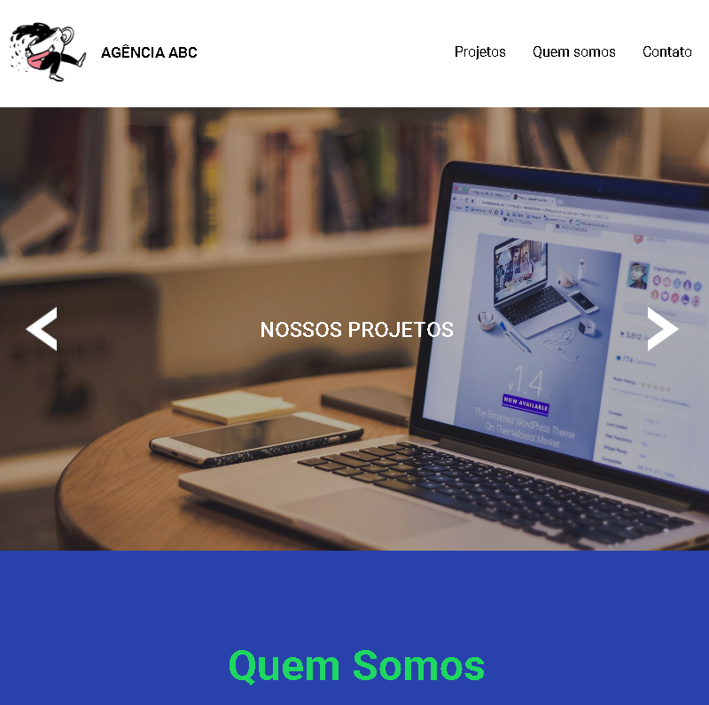

<h1 align="center">Agência ABC</h1>

#### Esta é uma página para uma agência fictícia chamada 'Agência ABC'. Apresenta um cabeçalho com o logotipo da agência e um menu de navegação. O conteúdo inclui seções sobre os projetos da agência e uma breve descrição sobre a equipe. O rodapé contém links para redes sociais.

### Tecnologias Utilizadas
- HTML
- CSS
- JavaScript
  
### Autor
<a href="https://avatars.githubusercontent.com/u/146045369?v=4">
 
  
</a>
 <h3>Lucas Noetzold</h3>
  
 <b>Entre em contato!</b>

